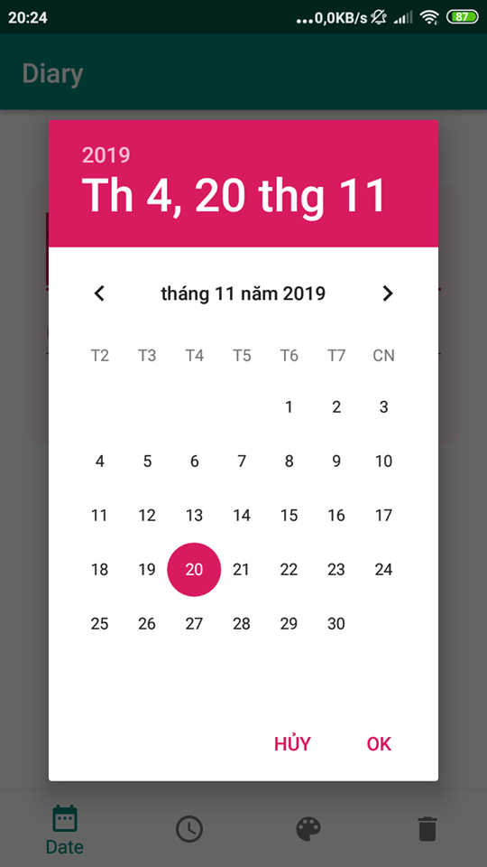
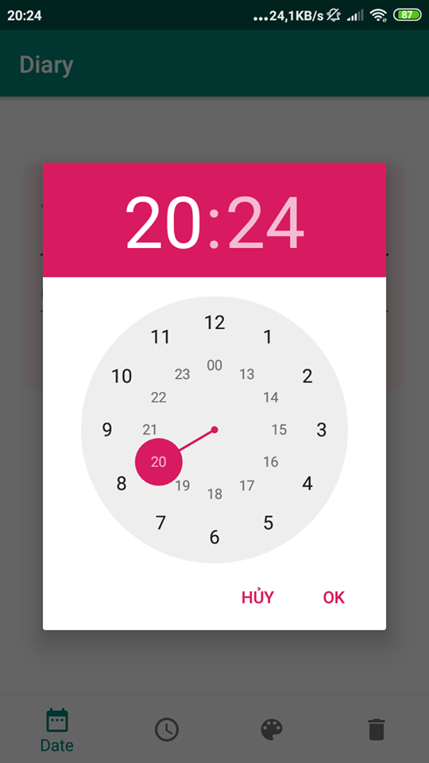
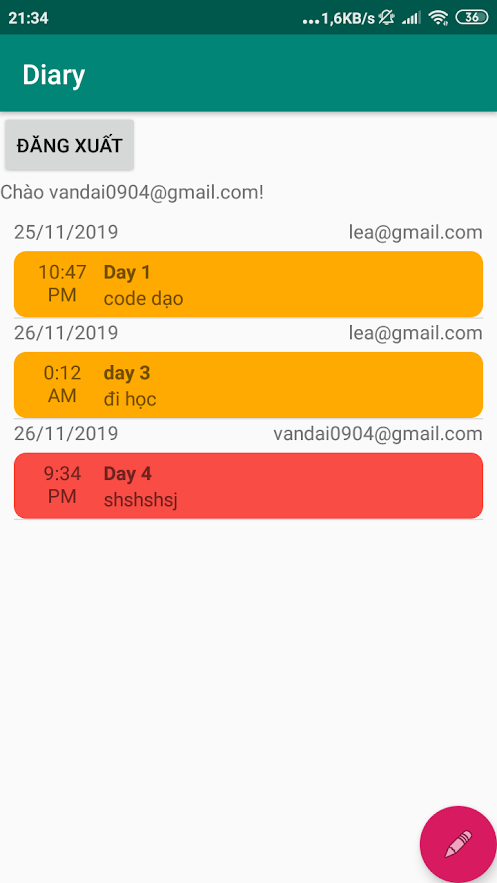

# Diary & Firebase
###1. Use Firebase as realtime Database to save data Diary.

###2. Use DatePickerDialog, TimePickerDialog, ColorPicker to support app.

###3. Tasks:
-[x] Login database
-[x] Add data into Firebase database
-[x] Logout database

-[] Delete data
-[] Update data
-[] Sign up  